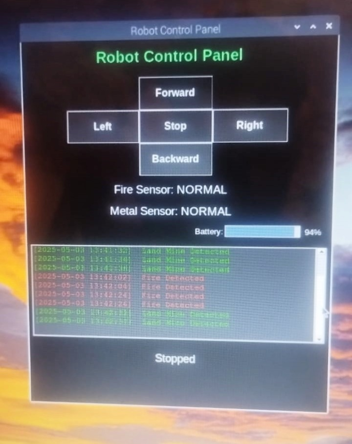
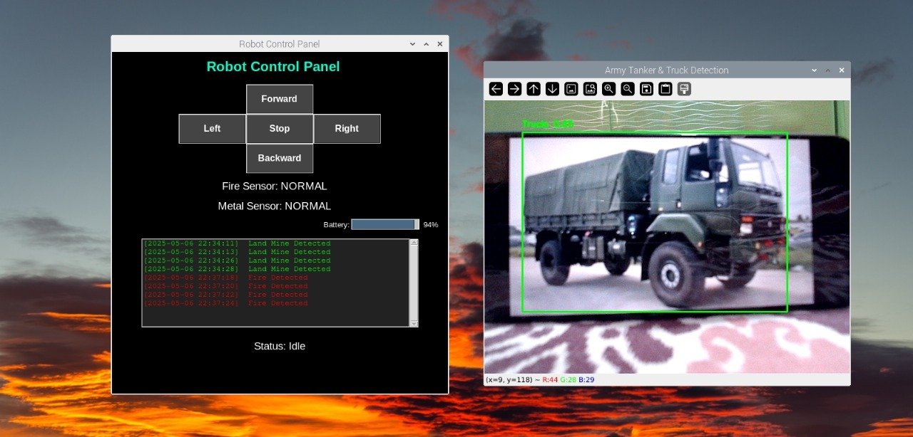
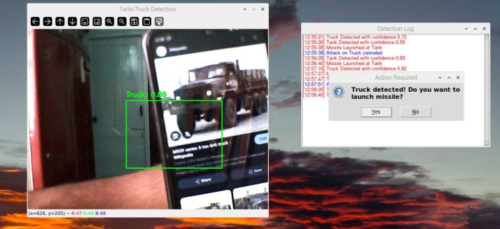
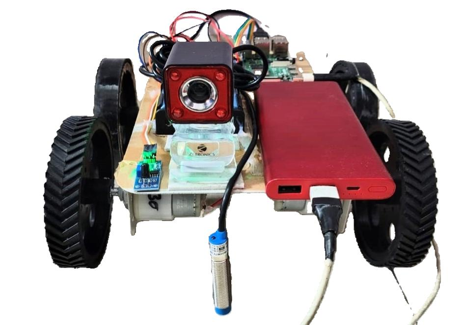
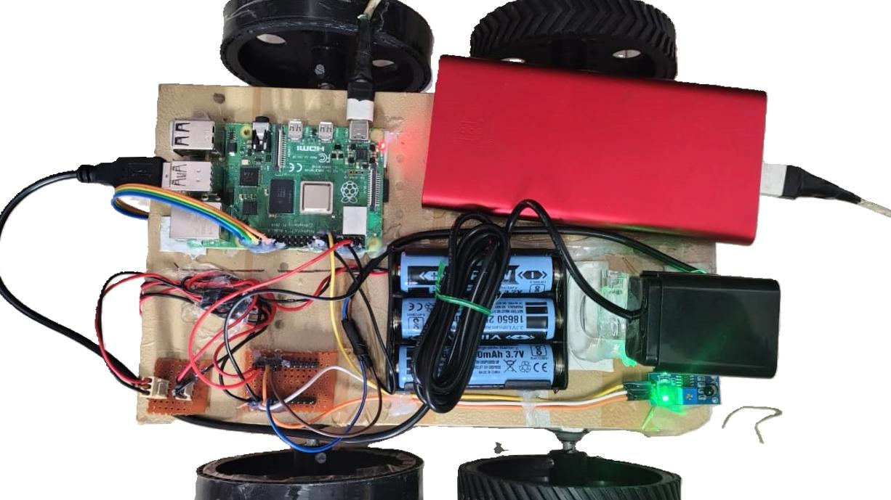
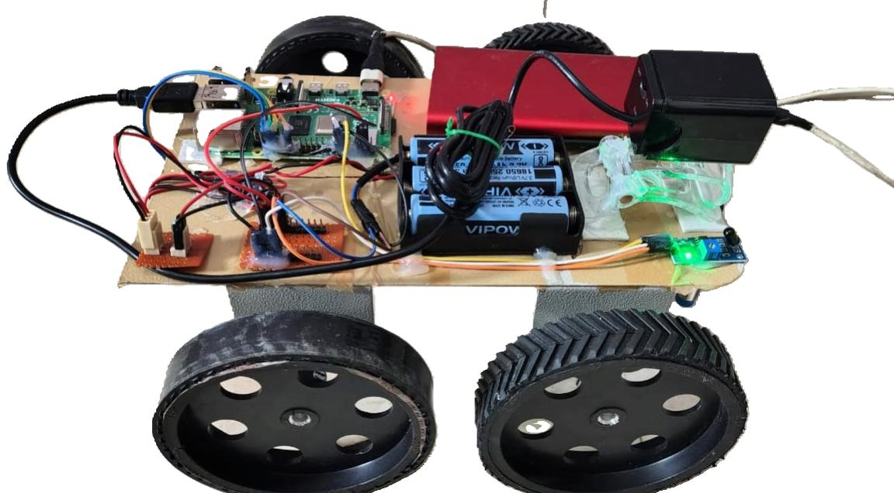

# 🛡️ Battlefield Surveillance Robot using Wireless Night Vision Camera

An intelligent surveillance robot built using Raspberry Pi, YOLO object detection, and real-time sensors to detect critical battlefield threats such as fire, landmines, tanks, and trucks. It provides live logging, user interaction, and robotic control through a GUI panel.

---

## 🔧 Features

- 🔍 Object Detection (Tank/Truck) using YOLOv8
- 📸 Wireless night vision camera feed
- 🔥 Fire sensor with alert and logging
- 💣 Metal (landmine) detection with buzzer
- 🧠 Intelligent alert system with confirmation popups
- 🎮 GUI control panel with keyboard support
- 🧾 Real-time logs with scrollable UI
- 🗂️ Auto logging to `.txt` file for analysis
- ✅ Battery indicator bar
- 🧵 Multithreaded design for performance

---

## 🧱 Technologies Used

- Raspberry Pi
- Python 3
- OpenCV
- Tkinter
- YOLOv8 (`ultralytics`)
- GPIO (for sensor input and buzzer output)
- Threading / RealVNC

---

## 📁 File Descriptions

| File | Description |
|------|-------------|
| `robo.py` | Main GUI file for robot control via keyboard, button, and sensor readout |
| `pred.py` | YOLO-based object detection |
| `delay.py` | Alternate detection version with debounce logic with live log GUI and confirmation popup (previous version) |
| `best.pt` | Trained YOLOv8 model used to detect Tank/Truck |
| `robot_logs.txt` | Log file that stores fire and landmine detection |
| `pred_logs.txt` | Log file that stores object detection events from `pred.py` |
| `README.md` | This file with all project details and structure |

---

## 🖥️ Setup Instructions

1. Network Setup: Ensure Raspberry Pi and your control device are connected to the same network.

2. Remote Connection: Use RealVNC Viewer to connect to your Raspberry Pi for remote access and control.

3. Clone the repo:
   ```bash
   git clone https://github.com/your-username/battlefield-robot.git
   cd battlefield-robot
   ```
4. Install dependencies:
   ```bash
   pip install -r requirements.txt
   sudo apt install python3-opencv
   sudo apt install python3-tk
   sudo apt install fonts-noto-color-emoji
   ```
5. On Raspberry Pi, install:
   ```bash
   sudo apt install python3-opencv
   sudo apt install python3-tk
   sudo apt install fonts-noto-color-emoji
   ```
6. Run the robot control GUI:
   ```bash
   python3 robo.py
   ```
7. Run the object detection GUI:
   ```bash
   python3 pred.py
   ```

---

## 📸 Screenshots

### 🎮 Robot Control GUI



### 🔍 Fire and Landmine Detection 

.

### 🧾 Real-time Log Viewer



---

## 🤖 Robot Pictures

Here are some pictures showcasing the robot in action and its components.


*Robot Image 1: Front view of the battlefield surveillance robot.*


*Robot Image 2: Top view highlighting the  Raspberrypi, sensors and camera.*


*Robot Image 3: Robot in operation during a field test.*

---
## 📜 License

This project is developed as part of an academic major project. Usage, distribution, or publication should credit the authors.

---

## 🙌 Authors

Surya Saroj — Project Lead & Developer

Team Members — [Charan, Mounika, Vaishnavi]
